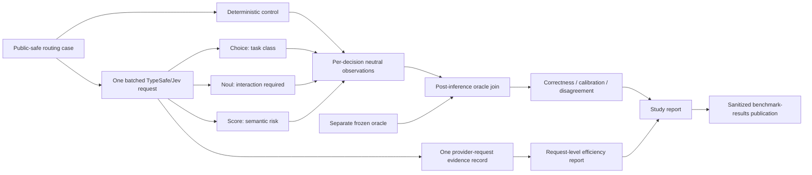

# Portfolio Rendering Notes — Comparative Decision Study

This file is intentionally maintained as a portfolio-facing engineering artifact. It contains only evidence-backed status and diagrams that can be rendered directly or partially by the portfolio site.

## Current implementation status

| Layer | Status | Evidence |
| --- | --- | --- |
| Phase 0 architecture/metric audit | complete | dated audit under `docs/audits/` |
| Study specification | frozen for implementation | `resources/studies/routing-semantic-v1.study.json` |
| Independent oracle | not yet frozen | intentionally separate from implementation |
| Lossless per-seam persistence | implementation in progress | Agent-Workflow comparative evidence branch |
| Study-grade metrics/reporting | implementation in progress | comparative-eval 0.2 work |
| Dedicated benchmark lane | implementation in progress | benchmark comparative-decision work |
| Full study | not run | blocked on independent oracle freeze |

## Architecture

## Important engineering result

The original system already preserved Jev probabilities/confidence in Agent-Workflow decision receipts, but the comparative persistence projection discarded those fields and kept primarily the composed route. That made the existing calibration implementation unusable on canonical normal-usage evidence.

The study work therefore focuses first on restoring the evidence chain rather than adding another model call or another headline metric.

## Claims safe to render now

- The comparison library already contains correctness, reliability, efficiency, calibration, pairing, and deterministic statistical primitives.
- TypeSafe/Jev remains an evidence provider; Agent-Workflow keeps deterministic workflow and lifecycle authority.
- The first study is preregistered around three existing routing seams and uses a separate blinded oracle.
- Provider overhead is accounted at the batched-request level to avoid triple-counting one request across three decisions.
- A favorable Jev result is not a publication requirement.

## Claims that must wait

Do not render claims that Jev improves routing correctness, quality, cost, or latency until the full independently labeled study is complete.
