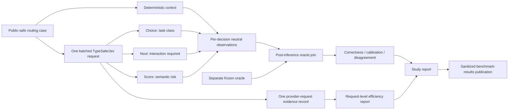

# Portfolio Rendering Notes — Comparative Decision Study

This file is intentionally maintained as a portfolio-facing engineering artifact. It contains only evidence-backed status and diagrams that can be rendered directly or partially by the portfolio site.

## Current implementation status

| Layer | Status | Evidence |
| --- | --- | --- |
| Phase 0 architecture/metric audit | complete | dated audit under `docs/audits/` |
| Study specification | frozen for implementation | `resources/studies/routing-semantic-v1.study.json` |
| Adjudicator runtime implementation | complete | Agent-Workflow Benchmark `7c3cef0ca3572005cb1266629b62dcbf65608440` (`0.4.1`) |
| Authenticated adjudicator qualification | complete | Debian-host P0A completed against the qualified `openai-api/codex-lb/deepseek-flash` path; IA-1 through IA-8 reported passing |
| Independent oracle | frozen and validated | P0B A/B/C adjudication, recorded three-way resolution, oracle freeze, and final corpus validation completed on the private host evidence path |
| Lossless per-seam persistence | implementation in progress | Agent-Workflow comparative evidence branch |
| Study-grade metrics/reporting | implementation in progress | comparative-eval 0.2 work |
| Dedicated benchmark lane | implementation in progress | benchmark comparative-decision work |
| P1 live instrumentation smoke | passed | 8 cases, 8 observed cases, 24 observations, 8 provider requests, 0 exclusions; all verification invariants passed |
| Full study | unblocked; not yet run | P2 may now execute the full 120-case inference and post-inference oracle join/report |

## Website-agent handoff

For the current portfolio synthesis boundary, use [`WEBSITE_AGENT_HANDOFF_2026-09-26.md`](WEBSITE_AGENT_HANDOFF_2026-09-26.md). It distinguishes newly safe oracle-completion claims from outcome claims that remain blocked until P2.

## Architecture

```mermaid
flowchart LR
    A[Public-safe routing case] --> B[Deterministic control]
    A --> C[One batched TypeSafe/Jev request]
    C --> C1[Choice: task class]
    C --> C2[Noul: interaction required]
    C --> C3[Score: semantic risk]
    B --> D[Per-decision neutral observations]
    C1 --> D
    C2 --> D
    C3 --> D
    C --> E[One provider-request evidence record]
    F[Separate frozen oracle] --> G[Post-inference oracle join]
    D --> G
    E --> H[Request-level efficiency report]
    G --> I[Correctness / calibration / disagreement]
    H --> J[Study report]
    I --> J
    J --> K[Sanitized benchmark-results publication]
```

## Important engineering result

The original system already preserved Jev probabilities/confidence in Agent-Workflow decision receipts, but the comparative persistence projection discarded those fields and kept primarily the composed route. That made the existing calibration implementation unusable on canonical normal-usage evidence.

The study work therefore focuses first on restoring the evidence chain rather than adding another model call or another headline metric.

## Claims safe to render now

- The comparison library already contains correctness, reliability, efficiency, calibration, pairing, and deterministic statistical primitives.
- TypeSafe/Jev remains an evidence provider; Agent-Workflow keeps deterministic workflow and lifecycle authority.
- The first study is preregistered around three existing routing seams and uses a separate blinded oracle. The Inspect AI + Inspect SWE + Codex CLI adjudication runtime passed authenticated P0A qualification, and the independent A/B/C oracle was subsequently frozen and validated on the private host evidence path.
- Provider overhead is accounted at the batched-request level to avoid triple-counting one request across three decisions.
- P1 live instrumentation verification passed on 8 deterministic development cases: 8 provider requests, 24 per-seam observations, and 0 exclusions. The smoke verified oracle absence during inference, privacy boundaries, probability persistence, unique request IDs, one request per observed case, three observations per case, and the frozen `routing/v2` / `routing-state/v2` identities.
- A favorable Jev result is not a publication requirement.

## Claims that must wait

Do not render claims that Jev improves routing correctness, quality, cost, or latency until the full independently labeled P2 study is complete. P1 proves that the intended evidence path works on a bounded development sample; it is not comparative-effectiveness evidence.

---

<small>Last updated: 2026-09-26 11:56 PDT — P1 smoke passed; P2 unblocked</small>
