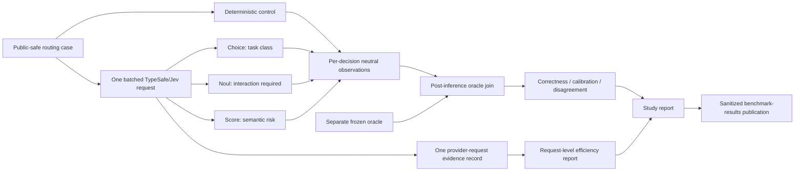

# Portfolio Rendering Notes — Comparative Decision Study

This file is intentionally maintained as a portfolio-facing engineering artifact. It contains only evidence-backed status and diagrams that can be rendered directly or partially by the portfolio site.

## Current implementation status

| Layer | Status | Evidence |
| --- | --- | --- |
| Phase 0 architecture/metric audit | complete | dated audit under `docs/audits/` |
| Study specification | frozen for implementation | `resources/studies/routing-semantic-v1.study.json` |
| Adjudicator runtime implementation | complete | Agent-Workflow Benchmark `7c3cef0ca3572005cb1266629b62dcbf65608440` (`0.4.1`) |
| Authenticated adjudicator qualification | complete | Debian-host P0A completed against the qualified `openai-api/codex-lb/deepseek-flash` path; IA-1 through IA-8 reported passing |
| Oracle-baseline API accounting | recorded through freeze | OpenAI Codex harness -> `codex-lb` -> DeepSeek-4.1-Flash; $0.07 USD, 36 API requests, 726,263 tokens; excludes P1/P2/P3 |
| Independent oracle | frozen and validated | P0B A/B/C adjudication, recorded three-way resolution, oracle freeze, and final corpus validation completed on the private host evidence path |
| Lossless per-seam persistence | complete | P1/P2 evidence preserved Choice/Noul/Score probabilities and request-level identity through reporting |
| Study-grade metrics/reporting | complete | P2 report completed across all three seams at n=120 |
| Dedicated benchmark lane | complete | P1/P2/P3 repository-owned phase scripts and verification gates |
| P1 live instrumentation smoke | passed | 8 cases, 8 observed cases, 24 observations, 8 provider requests, 0 exclusions; all verification invariants passed |
| Full study | complete and published | 120 cases, 360 observations, 120 provider requests, 360 oracle outcomes, 0 exclusions; P3 verification passed and sanitized public result is in benchmark-results |

## Website-agent handoff

For the current portfolio synthesis boundary, use [`WEBSITE_AGENT_HANDOFF_2026-09-27.md`](WEBSITE_AGENT_HANDOFF_2026-09-27.md). It is grounded in the P3-verified public result and supersedes the earlier pre-publication handoff for current rendering.

## Architecture

```mermaid
flowchart LR
    A[Public-safe routing case] --> B[Deterministic control]
    A --> C[One batched TypeSafe/Jev request]
    C --> C1[Choice: task class]
    C --> C2[Noul: interaction required]
    C --> C3[Score: semantic risk]
    B --> D[Per-decision neutral observations]
    C1 --> D
    C2 --> D
    C3 --> D
    C --> E[One provider-request evidence record]
    F[Separate frozen oracle] --> G[Post-inference oracle join]
    D --> G
    E --> H[Request-level efficiency report]
    G --> I[Correctness / calibration / disagreement]
    H --> J[Study report]
    I --> J
    J --> K[Sanitized benchmark-results publication]
```

## Important engineering result

The original system already preserved Jev probabilities/confidence in Agent-Workflow decision receipts, but the comparative persistence projection discarded those fields and kept primarily the composed route. That made the existing calibration implementation unusable on canonical normal-usage evidence.

The study work therefore focuses first on restoring the evidence chain rather than adding another model call or another headline metric.

## Methodology correction discovered after oracle freeze

The completed v1 oracle's authoritative A/B/C passes retained independent labels but no structured decision justifications. A later audit of the retained private Inspect logs found contemporaneous provider reasoning summaries for the cohort. Those summaries were supplementary execution evidence and were not surfaced to the original human-resolution workflow.

The precise failure was therefore **decision-provenance promotion**, not total loss of explanatory evidence: the pipeline reduced the durable adjudication pass to labels even though useful reasoning-summary evidence survived elsewhere. The frozen oracle is not being rewritten and the later-discovered summaries are not retrofitted into it.

Detailed postmortem: [`2026-09-26-oracle-decision-justification-evidence-gap.md`](../audits/2026-09-26-oracle-decision-justification-evidence-gap.md).

Corrective audit: [`2026-09-27-oracle-reasoning-summary-retention-audit.md`](../audits/2026-09-27-oracle-reasoning-summary-retention-audit.md).

Focused website handoff: [`WEBSITE_AGENT_HANDOFF_ORACLE_EVIDENCE_GAP_2026-09-26.md`](WEBSITE_AGENT_HANDOFF_ORACLE_EVIDENCE_GAP_2026-09-26.md).

## v2 follow-up now in implementation

The v1 oracle remains immutable.

The next cycle is now split into two separate studies:

- `routing-semantic-v2` — methodological replication of the oracle/evidence process with required structured justifications and explicit provenance scope;
- `agentic-jev-pilot-v1` — 24-task exploratory baseline / skill-only / skill+Jev study using the existing Inspect/Inspect-SWE Codex harness.

The v2 corpus identity has been created as `routing-semantic-corpus-v2.0.0-draft.1` and is regression-tested to preserve the exact v1 case content apart from identity. The benchmark implementation includes pass-v2, IA-9/10/11 evidence preflight, a frozen TypeSafe skill snapshot, a host-side bridged Jev tool, runtime locking, live tool qualification, and the three-arm pilot runner.

Current execution boundary: live IA-9/10/11 preflight and agentic-Jev tool qualification must pass before freezing the real v2 authoring view or running the 24 × 3 pilot.

Detailed checkpoint: [`2026-09-27-comparative-study-v8-v2-live-boundary.md`](../checkpoints/2026-09-27-comparative-study-v8-v2-live-boundary.md).

Design contract: [`routing-semantic-v2-adjudication-evidence-contract.md`](../plans/routing-semantic-v2-adjudication-evidence-contract.md).

## Claims safe to render now

- The comparison library already contains correctness, reliability, efficiency, calibration, pairing, and deterministic statistical primitives.
- TypeSafe/Jev remains an evidence provider; Agent-Workflow keeps deterministic workflow and lifecycle authority.
- The first study is preregistered around three existing routing seams and uses a separate blinded oracle. The Inspect AI + Inspect SWE + Codex CLI adjudication runtime passed authenticated P0A qualification, and the independent A/B/C oracle was subsequently frozen and validated on the private host evidence path.
- The oracle-baseline runs used the OpenAI Codex harness routed through `codex-lb` to the DeepSeek-4.1-Flash API. Cumulative provider/API accounting through oracle freeze was $0.07 USD, 36 requests, and 726,263 tokens. This excludes P1/P2/P3 and is not Jev treatment cost.
- Provider overhead is accounted at the batched-request level to avoid triple-counting one request across three decisions.
- P1 live instrumentation verification passed on 8 deterministic development cases: 8 provider requests, 24 per-seam observations, and 0 exclusions. The smoke verified oracle absence during inference, privacy boundaries, probability persistence, unique request IDs, one request per observed case, three observations per case, and the frozen `routing/v2` / `routing-state/v2` identities.
- P3 publication verification passed: exact file allowlist, manifest integrity, public oracle projection, privacy contract, and full 120-case sample identity.
- In the frozen cohort, semantic-candidate accuracy was 91.67% vs 71.67% for interaction-required and 81.67% vs 52.50% for task class; the paired 95% intervals for both accuracy differences remained above zero.
- Semantic-risk MAE was 0.28975 vs 0.29167 and its paired interval spans zero; this seam should not be described as materially improved.
- All 120 provider requests succeeded; provider cost evidence remains incomplete.
- A favorable Jev result was never a publication requirement.

## Public claim boundary

The P3-verified public evidence now supports the seam-level correctness, calibration, request reliability, latency, and token findings summarized above.

Do not generalize these findings into universal TypeSafe/Jev superiority, downstream software-quality causality, cost advantage, or semantic-risk improvement. Provider cost evidence is incomplete and the semantic-risk interval spans zero.

---

<small>Last updated: 2026-09-27 — v1 remains complete/published; v2 evidence repair and agent-directed Jev pilot are implemented through the live-preflight boundary</small>
