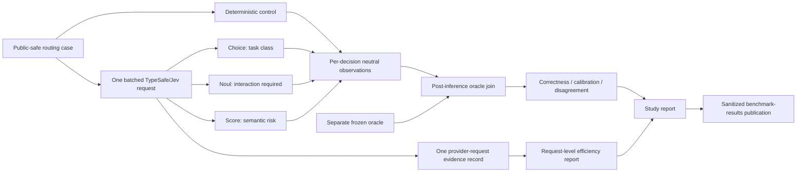

# Portfolio Rendering Notes — Comparative Decision Study

This file is intentionally maintained as a portfolio-facing engineering artifact. It contains only evidence-backed status and diagrams that can be rendered directly or partially by the portfolio site.

## Current implementation status

| Layer | Status | Evidence |
| --- | --- | --- |
| Phase 0 architecture/metric audit | complete | dated audit under `docs/audits/` |
| Study specification | frozen for implementation | `resources/studies/routing-semantic-v1.study.json` |
| Adjudicator runtime implementation | complete | Agent-Workflow Benchmark `7c3cef0ca3572005cb1266629b62dcbf65608440` (`0.4.1`) |
| Authenticated adjudicator qualification | complete | Debian-host P0A completed against the qualified `openai-api/codex-lb/deepseek-flash` path; IA-1 through IA-8 reported passing |
| Oracle-baseline API accounting | recorded through freeze | OpenAI Codex harness -> `codex-lb` -> DeepSeek-4.1-Flash; $0.07 USD, 36 API requests, 726,263 tokens; excludes P1/P2/P3 |
| Independent oracle | frozen and validated | P0B A/B/C adjudication, recorded three-way resolution, oracle freeze, and final corpus validation completed on the private host evidence path |
| Lossless per-seam persistence | implementation in progress | Agent-Workflow comparative evidence branch |
| Study-grade metrics/reporting | implementation in progress | comparative-eval 0.2 work |
| Dedicated benchmark lane | implementation in progress | benchmark comparative-decision work |
| P1 live instrumentation smoke | passed | 8 cases, 8 observed cases, 24 observations, 8 provider requests, 0 exclusions; all verification invariants passed |
| Full study | complete; private report generated | 120 cases, 360 observations, 120 provider requests, 0 exclusions; frozen oracle joined only after inference; sanitized P3 publication remains pending |

## Website-agent handoff

For the current portfolio synthesis boundary, use [`WEBSITE_AGENT_HANDOFF_2026-09-26.md`](WEBSITE_AGENT_HANDOFF_2026-09-26.md). It distinguishes newly safe oracle-completion claims from outcome claims that remain blocked until P2.

## Architecture

```mermaid
flowchart LR
    A[Public-safe routing case] --> B[Deterministic control]
    A --> C[One batched TypeSafe/Jev request]
    C --> C1[Choice: task class]
    C --> C2[Noul: interaction required]
    C --> C3[Score: semantic risk]
    B --> D[Per-decision neutral observations]
    C1 --> D
    C2 --> D
    C3 --> D
    C --> E[One provider-request evidence record]
    F[Separate frozen oracle] --> G[Post-inference oracle join]
    D --> G
    E --> H[Request-level efficiency report]
    G --> I[Correctness / calibration / disagreement]
    H --> J[Study report]
    I --> J
    J --> K[Sanitized benchmark-results publication]
```

## Important engineering result

The original system already preserved Jev probabilities/confidence in Agent-Workflow decision receipts, but the comparative persistence projection discarded those fields and kept primarily the composed route. That made the existing calibration implementation unusable on canonical normal-usage evidence.

The study work therefore focuses first on restoring the evidence chain rather than adding another model call or another headline metric.

## Methodology correction discovered after oracle freeze

The completed v1 oracle's authoritative A/B/C passes retained independent labels but no structured decision justifications. A later audit of the retained private Inspect logs found contemporaneous provider reasoning summaries for the cohort. Those summaries were supplementary execution evidence and were not surfaced to the original human-resolution workflow.

The precise failure was therefore **decision-provenance promotion**, not total loss of explanatory evidence: the pipeline reduced the durable adjudication pass to labels even though useful reasoning-summary evidence survived elsewhere. The frozen oracle is not being rewritten and the later-discovered summaries are not retrofitted into it.

Detailed postmortem: [`2026-09-26-oracle-decision-justification-evidence-gap.md`](../audits/2026-09-26-oracle-decision-justification-evidence-gap.md).

Corrective audit: [`2026-09-27-oracle-reasoning-summary-retention-audit.md`](../audits/2026-09-27-oracle-reasoning-summary-retention-audit.md).

Focused website handoff: [`WEBSITE_AGENT_HANDOFF_ORACLE_EVIDENCE_GAP_2026-09-26.md`](WEBSITE_AGENT_HANDOFF_ORACLE_EVIDENCE_GAP_2026-09-26.md).

## Future-cohort follow-up

The v1 oracle remains immutable. The next-version adjudication/provenance design is tracked in [`routing-semantic-v2-adjudication-evidence-contract.md`](../plans/routing-semantic-v2-adjudication-evidence-contract.md). It requires structured per-decision justifications and explicit aggregate-session usage provenance before another real oracle cohort can run.

## Claims safe to render now

- The comparison library already contains correctness, reliability, efficiency, calibration, pairing, and deterministic statistical primitives.
- TypeSafe/Jev remains an evidence provider; Agent-Workflow keeps deterministic workflow and lifecycle authority.
- The first study is preregistered around three existing routing seams and uses a separate blinded oracle. The Inspect AI + Inspect SWE + Codex CLI adjudication runtime passed authenticated P0A qualification, and the independent A/B/C oracle was subsequently frozen and validated on the private host evidence path.
- The oracle-baseline runs used the OpenAI Codex harness routed through `codex-lb` to the DeepSeek-4.1-Flash API. Cumulative provider/API accounting through oracle freeze was $0.07 USD, 36 requests, and 726,263 tokens. This excludes P1/P2/P3 and is not Jev treatment cost.
- Provider overhead is accounted at the batched-request level to avoid triple-counting one request across three decisions.
- P1 live instrumentation verification passed on 8 deterministic development cases: 8 provider requests, 24 per-seam observations, and 0 exclusions. The smoke verified oracle absence during inference, privacy boundaries, probability persistence, unique request IDs, one request per observed case, three observations per case, and the frozen `routing/v2` / `routing-state/v2` identities.
- A favorable Jev result is not a publication requirement.

## Claims that must wait

P2 has completed on the full frozen cohort, but sanitized public evidence preparation/review remains pending. Do not publish comparative correctness, calibration, cost, latency, or winner claims from private P2 artifacts until the P3 publication boundary is reviewed and approved.

---

<small>Last updated: 2026-09-27 — P2 complete; reasoning-summary retention audit corrected the oracle-provenance diagnosis; P3 publication pending</small>
