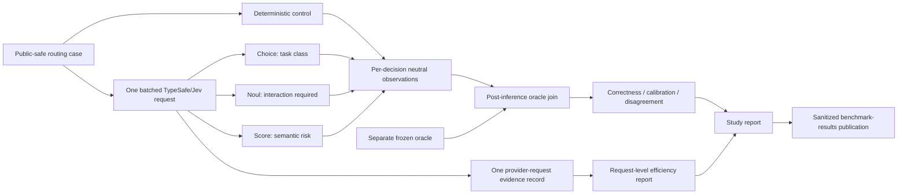

# Portfolio Rendering Notes — Comparative Decision Study

This file is intentionally maintained as a portfolio-facing engineering artifact. It contains only evidence-backed status and diagrams that can be rendered directly or partially by the portfolio site.

## Current implementation status

| Layer | Status | Evidence |
| --- | --- | --- |
| Phase 0 architecture/metric audit | complete | dated audit under `docs/audits/` |
| Study specification | frozen for implementation | `resources/studies/routing-semantic-v1.study.json` |
| Adjudicator runtime implementation | complete | Agent-Workflow Benchmark `7c3cef0ca3572005cb1266629b62dcbf65608440` (`0.4.1`) |
| Authenticated adjudicator qualification | complete | Debian-host P0A completed against the qualified `openai-api/codex-lb/deepseek-flash` path; IA-1 through IA-8 reported passing |
| Oracle-baseline API accounting | recorded through freeze | OpenAI Codex harness -> `codex-lb` -> DeepSeek-4.1-Flash; $0.07 USD, 36 API requests, 726,263 tokens; excludes P1/P2/P3 |
| Independent oracle | frozen and validated | P0B A/B/C adjudication, recorded three-way resolution, oracle freeze, and final corpus validation completed on the private host evidence path |
| Lossless per-seam persistence | complete | P1/P2 evidence preserved Choice/Noul/Score probabilities and request-level identity through reporting |
| Study-grade metrics/reporting | complete | P2 report completed across all three seams at n=120 |
| Dedicated benchmark lane | complete | P1/P2/P3 repository-owned phase scripts and verification gates |
| P1 live instrumentation smoke | passed | 8 cases, 8 observed cases, 24 observations, 8 provider requests, 0 exclusions; all verification invariants passed |
| Full study | complete and published | 120 cases, 360 observations, 120 provider requests, 360 oracle outcomes, 0 exclusions; P3 verification passed and sanitized public result is in benchmark-results |

## Website-agent handoff

For the current portfolio synthesis boundary, use [`WEBSITE_AGENT_HANDOFF_2026-09-27.md`](WEBSITE_AGENT_HANDOFF_2026-09-27.md). It is grounded in the P3-verified public result and supersedes the earlier pre-publication handoff for current rendering.

## Architecture

```mermaid
flowchart LR
    A[Public-safe routing case] --> B[Deterministic control]
    A --> C[One batched TypeSafe/Jev request]
    C --> C1[Choice: task class]
    C --> C2[Noul: interaction required]
    C --> C3[Score: semantic risk]
    B --> D[Per-decision neutral observations]
    C1 --> D
    C2 --> D
    C3 --> D
    C --> E[One provider-request evidence record]
    F[Separate frozen oracle] --> G[Post-inference oracle join]
    D --> G
    E --> H[Request-level efficiency report]
    G --> I[Correctness / calibration / disagreement]
    H --> J[Study report]
    I --> J
    J --> K[Sanitized benchmark-results publication]
```

## Important engineering result

The original system already preserved Jev probabilities/confidence in Agent-Workflow decision receipts, but the comparative persistence projection discarded those fields and kept primarily the composed route. That made the existing calibration implementation unusable on canonical normal-usage evidence.

The study work therefore focuses first on restoring the evidence chain rather than adding another model call or another headline metric.

## Methodology correction discovered after oracle freeze

The completed v1 oracle's authoritative A/B/C passes retained independent labels but no structured decision justifications. A later audit of the retained private Inspect logs found contemporaneous provider reasoning summaries for the cohort. Those summaries were supplementary execution evidence and were not surfaced to the original human-resolution workflow.

The precise failure was therefore **decision-provenance promotion**, not total loss of explanatory evidence: the pipeline reduced the durable adjudication pass to labels even though useful reasoning-summary evidence survived elsewhere. The frozen oracle is not being rewritten and the later-discovered summaries are not retrofitted into it.

Detailed postmortem: [`2026-09-26-oracle-decision-justification-evidence-gap.md`](../audits/2026-09-26-oracle-decision-justification-evidence-gap.md).

Corrective audit: [`2026-09-27-oracle-reasoning-summary-retention-audit.md`](../audits/2026-09-27-oracle-reasoning-summary-retention-audit.md).

Focused website handoff: [`WEBSITE_AGENT_HANDOFF_ORACLE_EVIDENCE_GAP_2026-09-26.md`](WEBSITE_AGENT_HANDOFF_ORACLE_EVIDENCE_GAP_2026-09-26.md).

## v2 follow-up now in implementation

The v1 oracle remains immutable.

The next cycle is now split into two separate studies:

- `routing-semantic-v2` — methodological replication of the oracle/evidence process with required structured justifications and explicit provenance scope;
- `agentic-jev-pilot-v1` — 24-task exploratory baseline / skill-only / skill+Jev study using the existing Inspect/Inspect-SWE Codex harness.

The v2 corpus identity has been created as `routing-semantic-corpus-v2.0.0-draft.1` and is regression-tested to preserve the exact v1 case content apart from identity. The benchmark implementation includes pass-v2, IA-9/10/11 evidence preflight, a frozen TypeSafe skill snapshot, a host-side bridged Jev tool, runtime locking, live tool qualification, and the three-arm pilot runner.

Current execution boundary: live IA-9/10/11 preflight and agentic-Jev tool qualification must pass before freezing the real v2 authoring view or running the 24 × 3 pilot.

Detailed checkpoint: [`2026-09-27-comparative-study-v8-v2-live-boundary.md`](../checkpoints/2026-09-27-comparative-study-v8-v2-live-boundary.md).

A subsequent pre-live static review found that the agentic-Jev runtime lock did not yet bind the host-side Jev implementation or installed TypeSafe SDK version. This was corrected before any runtime lock or provider outcome was observed. Benchmark PR #55 merged the stronger contract: the lock now verifies the exact host-tool implementation SHA and `typesafe-sdk==0.6.0` before qualification/run.

Pre-freeze correction checkpoint: [`2026-09-27-comparative-study-v9-agentic-runtime-identity-hardening.md`](../checkpoints/2026-09-27-comparative-study-v9-agentic-runtime-identity-hardening.md).

A complete pre-live review then tightened the remaining execution boundaries before any new treatment outcome was observed. Benchmark PR #56 now rechecks the frozen Inspect/SWE, Codex platform, Docker/Compose, sandbox-image, Inspect-harness, host-tool, TypeSafe SDK, skill, and task identities and makes the Jev bridge qualification exactly-once. PR #57 restores the historical v1 provenance shape while keeping the corrected scoped usage contract in v2.

Current readiness checkpoint: [`2026-09-27-comparative-study-v10-prelive-readiness-review.md`](../checkpoints/2026-09-27-comparative-study-v10-prelive-readiness-review.md).

Before live qualification, the model identities were then frozen separately by study purpose. `routing-semantic-v2` retains the v1-matched DeepSeek Flash adjudicator path so the evidence-contract change is not confounded with a model change. `agentic-jev-pilot-v1` is now frozen on GPT-6 Luna at high reasoning effort across all three arms, with Responses API transport, explicit `gpt-6-luna` Codex model configuration, and a Codex CLI >=0.155.0 requirement.

Model-identity checkpoint: [`2026-09-27-comparative-study-v11-model-identity-split.md`](../checkpoints/2026-09-27-comparative-study-v11-model-identity-split.md).

The first live DeepSeek IA-9/10/11 preflight then exposed a benchmark terminal-output extraction gap at the C tiebreaker: the Inspect sample completed, but the harness assumed the adjudication JSON must be in `EvalSample.output.completion` and attempted to decode an empty value. Benchmark PR #60 / merge `37b1e9670bef79f648f0939e4f55fca2b3b6294b` adds a v2-only terminal-assistant fallback, records the selected completion source, preserves v1's historical extraction/provenance shape, and cleans generated preflight evidence before a forced retry.

First-live correction checkpoint: [`2026-09-27-comparative-study-v12-first-live-preflight-output-correction.md`](../checkpoints/2026-09-27-comparative-study-v12-first-live-preflight-output-correction.md).

The clean retry then completed far enough to evaluate all three v2 evidence gates: **IA-9 passed, IA-10 failed, and IA-11 passed**. The A/B/C usage evidence contained token totals, but `model_call_count` and `provider_request_count` were null because the pinned Inspect `ModelUsage` aggregate does not provide those counters. Benchmark PR #61 made non-passing gates and the artifact path explicit. Benchmark PR #62 / merge `a898b39d6ef476e99dc1d33080c7b6e01c2494f9` corrects IA-10 by deriving logical model-call and provider-request counts from typed Inspect `ModelEvent` records, counting retries while excluding cache reads from provider requests, and failing closed on invalid retry evidence. The same release advances benchmark to `0.5.0` and pins comparative-eval `0.3.0`.

Second-live correction checkpoint: [`2026-09-28-comparative-study-v13-second-live-preflight-provenance-counts.md`](../checkpoints/2026-09-28-comparative-study-v13-second-live-preflight-provenance-counts.md).

Subsequent v2 work advanced through full structured-justification prompt/validation hardening and native Codex final-output JSON Schema enforcement. Benchmark 0.6.2 exposed `codex_cli(output_schema=...)` through a byte-pinned Inspect-SWE compatibility seam while retaining strict whole-completion parsing and post-generation contract validation. That implementation milestone is preserved in [`2026-09-28-comparative-study-v18-v2-structured-output-implemented.md`](../checkpoints/2026-09-28-comparative-study-v18-v2-structured-output-implemented.md).

The first live qualification attempt through that strengthened path then exposed a second integration boundary before any oracle sample completed: Inspect AI 0.3.268 warned that `const`, `minItems`, and `maxItems` were not modeled and would be dropped. Dropping the per-case `const` left an empty `case_id` schema node, and the provider rejected the request with HTTP 400 because that node lacked a `type`. No `qualification.json` was produced and no experimental evidence was admitted.

The Inspect-SWE compatibility feature was strengthened to fail closed at `codex_cli(output_schema=...)` construction when the active Inspect bridge cannot faithfully preserve a supplied constraint. The check reports nested JSON Pointer paths, costs zero model calls, accepts bridge-representable `type + enum`, and does not rewrite caller schemas. The v2 generation schema uses `type + enum` for exact case IDs and leaves unsupported array cardinality to the unchanged deterministic post-generation validator. The local capability identity advances to v2 and benchmark provenance to 0.6.3.

The capability-v2 live retry then progressed past the v19 schema-transport rejection but exposed a new end-to-end enforcement failure. A synthetic C sample completed successfully and returned a non-empty terminal answer containing explanatory prose followed by the intended JSON object. The strict whole-completion decoder correctly rejected the prose-prefixed result at character 0. The embedded JSON was not salvaged because doing so would hide whether native structured output was actually enforced.

Failure checkpoint: [`2026-09-29-comparative-study-v20-v2-native-structured-output-enforcement-failure.md`](../checkpoints/2026-09-29-comparative-study-v20-v2-native-structured-output-enforcement-failure.md).

A later archived retry added a sanitized loopback capture between the Inspect/OpenAI-compatible client and Codex-LB. The retry passed the complete qualification: `qualified=true` and IA-1 through IA-11 all reported `pass`. The capture observed 15 `POST /v1/responses` requests; every structured-output request carried `text.format.type=json_schema`, `strict=true`, and a schema SHA-256 matching the persisted primary or C schema artifact. Primary A/B, qualification C, and evidence-preflight A/B/C all returned JSON-object-only terminal completions. The prior v20 failure remains preserved as an intermittent structured-output enforcement failure whose exact historical provider-facing request was not captured.

Passing qualification checkpoint: [`2026-09-29-comparative-study-v21-v2-full-qualification-pass.md`](../checkpoints/2026-09-29-comparative-study-v21-v2-full-qualification-pass.md).

Benchmark PR #71 passed CI and the private live qualification, then merged as `9ef7f055b3475929ea95d3b2c7509b457c6299df`.

Before the first real A/B label was produced, a real-cohort scale review found that the 0.6.3 model schema repeated an identical record definition once per case. All 120 frozen cases share the same three eligible seams, so the per-case `anyOf` representation serialized to 225,971 characters while the equivalent eligibility-grouped representation serialized to 3,310 characters — a 98.54% reduction with the same 120 case identities and unchanged deterministic post-generation validation.

Scale-boundary checkpoint: [`2026-09-29-comparative-study-v22-v2-real-schema-scale-boundary.md`](../checkpoints/2026-09-29-comparative-study-v22-v2-real-schema-scale-boundary.md).

Benchmark 0.6.4 therefore groups cases by eligible-decision shape and records the strategy identity `eligibility-grouped-case-enum/v1`. The v21 pass remains historical qualification evidence for 0.6.3 but cannot authorize a 0.6.4 real cohort: the core gate and v2 operator driver require the qualification IA-1 evidence to match both benchmark version and schema strategy.

Current execution boundary: real `routing-semantic-v2` A/B/C is re-blocked before any real label. Benchmark 0.6.4 / PR #72 must pass CI, then a fresh archived live qualification must pass IA-1 through IA-11 with the grouped-schema strategy and sanitized ingress proof. Keep strict whole-completion parsing and fail closed on any recurrence rather than salvaging embedded JSON.

Design contract: [`routing-semantic-v2-adjudication-evidence-contract.md`](../plans/routing-semantic-v2-adjudication-evidence-contract.md).

## Claims safe to render now

- The comparison library already contains correctness, reliability, efficiency, calibration, pairing, and deterministic statistical primitives.
- TypeSafe/Jev remains an evidence provider; Agent-Workflow keeps deterministic workflow and lifecycle authority.
- The first study is preregistered around three existing routing seams and uses a separate blinded oracle. The Inspect AI + Inspect SWE + Codex CLI adjudication runtime passed authenticated P0A qualification, and the independent A/B/C oracle was subsequently frozen and validated on the private host evidence path.
- The oracle-baseline runs used the OpenAI Codex harness routed through `codex-lb` to the DeepSeek-4.1-Flash API. Cumulative provider/API accounting through oracle freeze was $0.07 USD, 36 requests, and 726,263 tokens. This excludes P1/P2/P3 and is not Jev treatment cost.
- Provider overhead is accounted at the batched-request level to avoid triple-counting one request across three decisions.
- P1 live instrumentation verification passed on 8 deterministic development cases: 8 provider requests, 24 per-seam observations, and 0 exclusions. The smoke verified oracle absence during inference, privacy boundaries, probability persistence, unique request IDs, one request per observed case, three observations per case, and the frozen `routing/v2` / `routing-state/v2` identities.
- P3 publication verification passed: exact file allowlist, manifest integrity, public oracle projection, privacy contract, and full 120-case sample identity.
- In the frozen cohort, semantic-candidate accuracy was 91.67% vs 71.67% for interaction-required and 81.67% vs 52.50% for task class; the paired 95% intervals for both accuracy differences remained above zero.
- Semantic-risk MAE was 0.28975 vs 0.29167 and its paired interval spans zero; this seam should not be described as materially improved.
- All 120 provider requests succeeded; provider cost evidence remains incomplete.
- A favorable Jev result was never a publication requirement.

## Public claim boundary

The P3-verified public evidence now supports the seam-level correctness, calibration, request reliability, latency, and token findings summarized above.

Do not generalize these findings into universal TypeSafe/Jev superiority, downstream software-quality causality, cost advantage, or semantic-risk improvement. Provider cost evidence is incomplete and the semantic-risk interval spans zero.

---

<small>Last updated: 2026-09-29 — v21 preserves the first full IA-1..IA-11 qualification pass, while v22 records a newly discovered real-cohort schema-scale boundary before any real label; benchmark 0.6.4 grouped-schema hardening now requires a fresh live qualification before A/B may begin</small>
